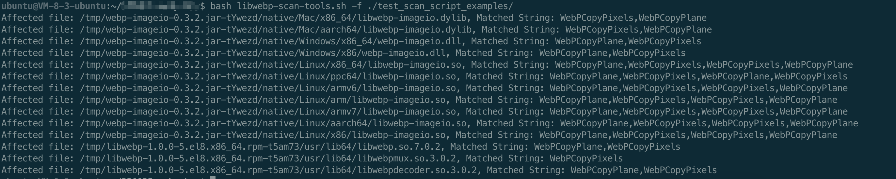
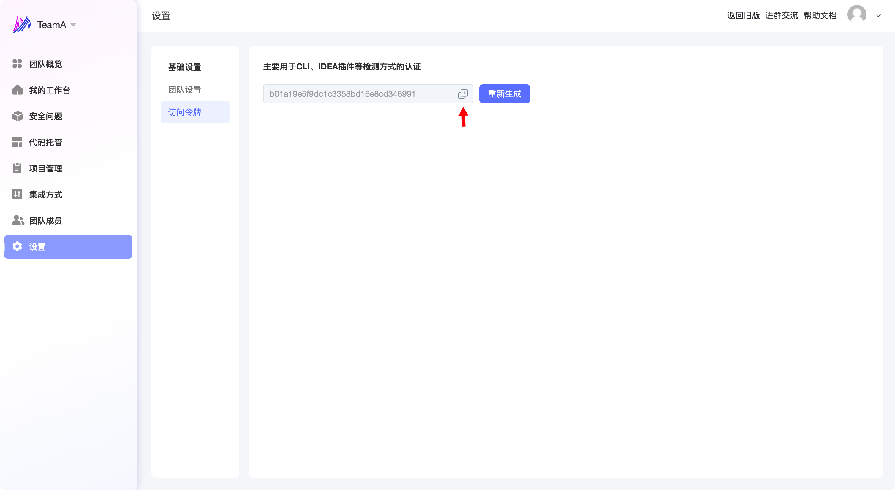

[中文](README_ZH.md) | EN

# CVE-2023-4863 libwebp dependency check tools
This tool checks if your server's application or process that is affected by CVE-2023-4863 libwebp Heap buffer overflow (Version above 0.5.0).

> Run this script in your production environment carefully.

### Result Screen Shot 

Scan Result

libwebp-checker.sh
  


  
  
  ## Table of Contents
1. [How it works](#how-it-works)
2. [Working Scenarios](#working-scenarios)
3. [Getting Started](#getting-started)
4. [Communication](#communication)
5. [License](#license)

## How it works
1. CVE-2023-4863 vulnerability affects libwebp versions 0.5.0 to 1.3.1. It identifies the affected libwebp by analyzing the processes' opened files and the target application files.
2. Starting from libwebp version 0.5.0, new export functions, `WebPCopyPlane` and `WebPCopyPixels`, were introduced. The vulnerable function is `VP8LBuildHuffmanTable`. Therefore, one can identify libwebp versions with vulnerabilities by matching these function names in the files.
3. In the security version 1.3.2, the `VP8LHuffmanTablesAllocate` function was added. If the target file has not been stripped, this function can also serve as a basis for version identification.

## Working Scenarios

In local or server environments, it aims to inspect specific paths, all running processes' binary files, jar packages, and rpm packages to determine if there is a dependency on the vulnerable component of libwebp.

## Getting Started
### 1. Get The Acess Token

> We analyze components from the Maven Central Repository to obtain hashes for the affected components, and we keep this data continuously updated. You can use this data for matching after authenticating with an access token from the MurphySec.com, which helps save analysis time.

Go to [MurphySec platform - Access Token](https://www.murphysec.com/console/set/token), click the copy button after the Token, then the access token is copied to the clipboard.





### 2. Detection

#### Scan Specific Directory Path

```
bash libwebp-checker.sh --token Your_Token_From_Console -f /path_you_want_scan/
```

#### Scan All Process 

```
bash libwebp-checker.sh --token Your_Token_From_Console -p
```


### 3. View Result

It will print the affected filenames, process IDs and matched string keywords, such as WebPCopyPlane,WebPCopyPlane. To help further analysis and update the component.

## Known Vulnerable Java Artifacts
```
ai.edgestore:engine
app.cash.paparazzi:layoutlib-native-linux
app.cash.paparazzi:native-linux
cn.ellabook:flutter-saassdk
cn.ellabook:saassdk
cn.fly2think:SmartPanorama
cn.fly2think:SmartPanoramaX
cn.rongcloud.sdk:fu_beautifier
com.aiyaapp.aiya:AyEffectSDK
com.computinglaboratory:opencv
com.criteo:jvips
com.eworkcloud.starter:ework-cloud-starter-image
com.eworkcloud:ework-cloud-starter-image
com.facebook.fresco:webpsupport
com.facebook.spectrum:spectrum-webp
com.freeletics.fork.paparazzi:layoutlib-native-linux
com.github.gotson:webp-imageio
com.github.jenly1314.WeChatQRCode:opencv-armv64
com.github.jenly1314.WeChatQRCode:opencv-armv7a
com.github.jenly1314.WeChatQRCode:opencv-x86
com.github.jenly1314.WeChatQRCode:opencv-x86_64
com.github.usefulness:webp-imageio
com.github.zjupure:webpdecoder
com.innov8tif.okaycam:opencv
com.innov8tif.okayid:opencv
com.scanzy:ScanzyBarcodeScannerSDK
com.waicool20.skrypton:skrypton-native-linux64
de.marcreichelt:webp-backport
de.sg-o.lib:opencv
id.mob:api-client
io.bitbucket.mobscannersdk:customdocscannerlib
io.bitbucket.mobscannersdk:docscannerlib
io.github.anylifezlb:slientEngine
io.github.darkxanter:webp-imageio
io.github.greycode:ocrlite
io.github.humbleui:skija-linux
io.github.humbleui:skija-linux-x64
io.github.izuiyou:octoflutter
io.github.jiemakel:octavo-assembly_2.12
io.github.zumikua:webploader-desktop
io.johnsonlee.layoutlib:native-linux
io.tiledb:tiledb-cloud-java
net.ifok.image:webp4j
org.demen.android.opencv:opencv
org.demen.android.opencv:opencv-img
org.demen.android.opencv:opencv_world
org.godotengine:godot
org.jetbrains.skiko:skiko-awt-runtime-linux-arm64
org.jetbrains.skiko:skiko-awt-runtime-linux-x64
org.jetbrains.skiko:skiko-jvm-runtime-linux-arm64
org.jetbrains.skiko:skiko-jvm-runtime-linux-x64
org.lucee:sejda-webp
org.openpnp:opencv
org.pireco:kypsdk
org.robolectric:nativeruntime-dist-compat
org.sejda.imageio:webp-imageio
org.sejda.webp-imageio:webp-imageio-sejda
science.aist:aistcv
```

## Communication
Contact our official WeChat account, and we'll add you into the group for communication.


## License
[Apache 2.0](LICENSE)