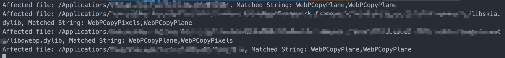
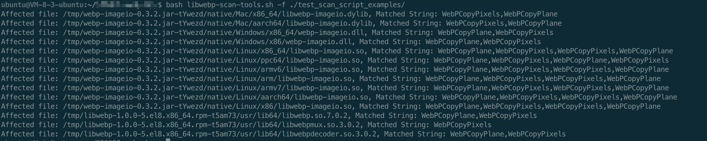

中文 | [EN](README.md)

# 针对CVE-2023-4863漏洞的libwebp检查工具

用于在命令行检测指定目录或当前运行进程中是否存在大于0.5.0版本的libwebp依赖，从而识别可能受到CVE-2023-4863漏洞影响的软件。
> 由于涉及文件扫描，建议尽量在测试环境中运行，以免影响生产服务。

### 效果截图

运行结果

  


  
  


## 目录

1. [工作原理](#工作原理)
2. [使用场景](#使用场景)
3. [使用步骤](#使用步骤)
4. [已发现的受影响java组件](#已发现的受影响java组件)
5. [交流和问题反馈](#交流和问题反馈)
6. [开源协议](#开源协议)

## 工作原理
1. CVE-2023-4863漏洞影响libwebp 0.5.0-1.3.1版本，通过对进程打开文件、目标应用文件的分析，识别是否存在受影响版本libwebp
2. libwebp 0.5.0版本开始新增了`WebPCopyPlane`和`WebPCopyPixels`函数作为导出函数，漏洞缺陷函数为`VP8LBuildHuffmanTable`，因此可以在文件中匹配这些特征函数名，从而识别识别有漏洞的libwebp
3. 1.3.2安全版本新增了`VP8LHuffmanTablesAllocate`函数，如果目标文件没有经过strip，其也可作为版本判断依据

## 使用场景
在本地或服务器环境中，针对指定路径、所有运行的进程中的二进制文件、jar包和rpm包，检测是否存在libwebp的漏洞组件依赖。


## 使用步骤

### 1. 获取访问令牌[可选]

> 我们通过对maven中央仓库中的组件分析，得到受影响组件对应的哈希，并在持续更新中。使用墨菲安全平台中账号的`访问令牌`认证后可以使用该数据进行匹配，从而节省分析时间。

进入[墨菲安全控制台](https://www.murphysec.com/console)，点击`设置` - `访问令牌`


### 2. 执行扫描

#### 扫描指定目录路径

```
bash libwebp-scan-tools.sh --token Your_Token_From_Console -f /path_you_want_scan/
```

#### 扫描当前服务器的所有进程文件

```
bash libwebp-scan-tools.sh --token Your_Token_From_Console -p
```


### 3. 查看结果 

命令行会打印受影响的文件名、进程 ID 以及匹配到的字符串关键字，如`WebPCopyPlane,WebPCopyPlane`。便于后续开展针对性的推进修复。

## 已发现的受影响java组件
```
ai.edgestore:engine
app.cash.paparazzi:layoutlib-native-linux
app.cash.paparazzi:native-linux
cn.ellabook:flutter-saassdk
cn.ellabook:saassdk
cn.fly2think:SmartPanorama
cn.fly2think:SmartPanoramaX
cn.rongcloud.sdk:fu_beautifier
com.aiyaapp.aiya:AyEffectSDK
com.computinglaboratory:opencv
com.criteo:jvips
com.eworkcloud.starter:ework-cloud-starter-image
com.eworkcloud:ework-cloud-starter-image
com.facebook.fresco:webpsupport
com.facebook.spectrum:spectrum-webp
com.freeletics.fork.paparazzi:layoutlib-native-linux
com.github.gotson:webp-imageio
com.github.jenly1314.WeChatQRCode:opencv-armv64
com.github.jenly1314.WeChatQRCode:opencv-armv7a
com.github.jenly1314.WeChatQRCode:opencv-x86
com.github.jenly1314.WeChatQRCode:opencv-x86_64
com.github.usefulness:webp-imageio
com.github.zjupure:webpdecoder
com.innov8tif.okaycam:opencv
com.innov8tif.okayid:opencv
com.scanzy:ScanzyBarcodeScannerSDK
com.waicool20.skrypton:skrypton-native-linux64
de.marcreichelt:webp-backport
de.sg-o.lib:opencv
id.mob:api-client
io.bitbucket.mobscannersdk:customdocscannerlib
io.bitbucket.mobscannersdk:docscannerlib
io.github.anylifezlb:slientEngine
io.github.darkxanter:webp-imageio
io.github.greycode:ocrlite
io.github.humbleui:skija-linux
io.github.humbleui:skija-linux-x64
io.github.izuiyou:octoflutter
io.github.jiemakel:octavo-assembly_2.12
io.github.zumikua:webploader-desktop
io.johnsonlee.layoutlib:native-linux
io.tiledb:tiledb-cloud-java
net.ifok.image:webp4j
org.demen.android.opencv:opencv
org.demen.android.opencv:opencv-img
org.demen.android.opencv:opencv_world
org.godotengine:godot
org.jetbrains.skiko:skiko-awt-runtime-linux-arm64
org.jetbrains.skiko:skiko-awt-runtime-linux-x64
org.jetbrains.skiko:skiko-jvm-runtime-linux-arm64
org.jetbrains.skiko:skiko-jvm-runtime-linux-x64
org.lucee:sejda-webp
org.openpnp:opencv
org.pireco:kypsdk
org.robolectric:nativeruntime-dist-compat
org.sejda.imageio:webp-imageio
org.sejda.webp-imageio:webp-imageio-sejda
science.aist:aistcv
```

## 交流和问题反馈

可联系并添加运营微信号，拉您进墨菲安全交流微信群


## 开源协议
[Apache 2.0](LICENSE)